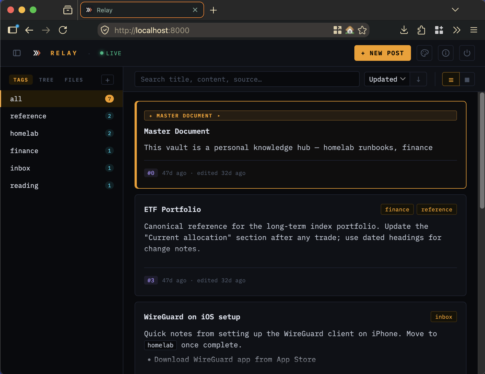
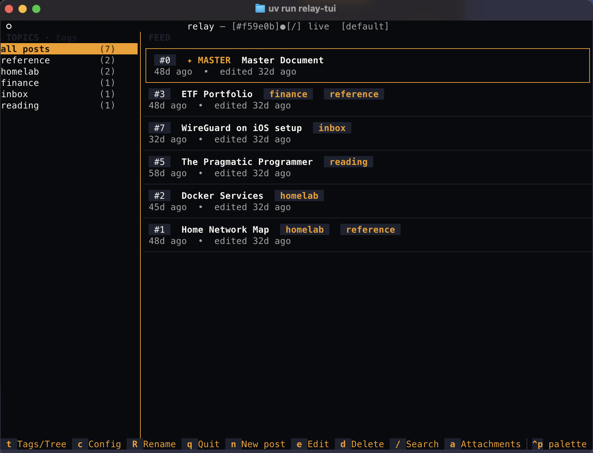

<div align="center">

<picture>
  <source media="(prefers-color-scheme: dark)" srcset="relay/static/assets/relay-mark-on-dark.svg">
  
</picture>

# relay

[](https://github.com/pierdom/relay/actions/workflows/tests.yml)
[](https://github.com/pierdom/relay/actions/workflows/docker.yml)
[](https://github.com/pierdom/relay/pkgs/container/relay)
[](LICENSE)
[](pyproject.toml)
[](https://github.com/astral-sh/uv)
[](https://github.com/astral-sh/ruff)
[](https://modelcontextprotocol.io)

**An AI-integration layer over a plain-Markdown, Obsidian-compatible vault.**

</div>

Your knowledge base lives as ordinary `.md` files on disk — browse it in Obsidian, `grep` it, git-version it, or open it in any editor. relay wraps that same vault with what AI systems need: an **MCP server**, a **REST API**, a real-time **SSE** stream, and **browser + terminal UIs**. Agents and humans share one store, not two.

<div align="center">

 

<sub>Browser UI &nbsp;·&nbsp; Terminal UI (nord palette — also ships dracula, gruvbox, solarized, molokai and more)</sub>

</div>

## Use cases

- **Knowledge base** — one agent writes a research note; another reads it back to inform its next action
- **Live digest** — a scheduled agent publishes a daily news digest; a browser tab or terminal shows it the moment it arrives
- **Agent memory** — agents store and update working notes as tagged posts, retrieved by tag or folder
- **Audit log** — every agent action gets POSTed as a structured entry; humans review the feed at leisure

## How it works

```
                    ┌─────────────────────────────────────────┐
   agent A ──MCP──► │                                         │ ──SSE push──► browser / TUI
   agent B ──REST─► │      relay        Markdown vault        │               (live)
   agent C ──MCP──► │   (API · index)  ── .md files on disk ──│ ◄──GET /posts─ client
                    │                   git history           │               reconnecting
                    └─────────────────────────────────────────┘               (Last-Event-ID
                                    ▲                                          replay)
                                    │
                        you, in Obsidian / nvim / grep
                     (watchdog picks the edit up and streams it)
```

**Files are the source of truth.** The SQLite index is disposable and rebuilt
from them at startup; every write is also committed to a git repo inside the
vault, so a clobbered post is recoverable.

## Quick start

```bash
cp .env.example .env   # set API_KEY to a strong secret
uv run python -m uvicorn relay.main:app --reload
```

Or with Docker (pre-built image from GHCR):

```bash
docker compose up -d
docker compose pull && docker compose up -d   # update within the pinned 0.8.x line
```

The compose file pins `ghcr.io/pierdom/relay:0.8` (the 0.8 minor line) so updates are deliberate and rollback-able; pin an exact `:0.8.N` to freeze a version. **A minor bump moves the tag line**, so an existing deployment pinned to `:0.7` keeps serving 0.7.x until its own compose file is moved to `:0.8` — `docker compose pull` alone is a no-op across a minor. Every `vX.Y.Z` git tag publishes `:X.Y.Z` and `:X.Y` to GHCR.

Service on `http://localhost:8000` — interactive docs at `/docs`.

## Try the sample vault

`sample_vault/` contains 8 posts across 5 folders demonstrating `[[wikilink]]` cross-linking, auto-expiring digests, the Inbox staging area, and a filled-out Master Document:

```bash
RELAY_VAULT_PATH=./sample_vault uv run python -m uvicorn relay.main:app --reload
```

Open `http://localhost:8000/ui`. See [docs/usage.md](docs/usage.md) for the workflow it demonstrates — adapt it to your own needs.

## Interfaces

**Browser UI** (`GET /ui`) — live SSE feed, compose/edit forms, attachment gallery, tag/folder/search filters, and `[[wikilink]]` cross-references. A post's history panel diffs any revision against the post as it stands, and the status panel's Recovery section finds posts that are *gone* and puts them back — which needs no id, the thing you never have after a delete. Fifteen themes — Relay Dark/Light plus ANSI, Catppuccin, Dracula, Everforest, Gruvbox, Molokai, Nord and Tokyo Night — all off one token layer, each a single block of variable overrides. On a phone every modal is a bottom sheet you can pull down to dismiss.

**Terminal UI** (`uv run relay-tui`) — keyboard-driven two-panel split: TOPICS sidebar + FEED list (`n` new, `e` edit, `d` delete, `Enter` view, `/` search, `q` quit). Set `RELAY_PALETTE` to match your terminal — themes include `nord`, `dracula`, `gruvbox`, `solarized`, `molokai`, and more.

**MCP server** — 19 MCP tools over Streamable HTTP (`/mcp`) or the legacy stdio proxy, including listing what was deleted, reading any revision, and restoring it. See [docs/mcp.md](docs/mcp.md).

## Development

```bash
uv sync --all-extras --dev   # install (uv only — never pip)
uv run pytest -q             # 373 tests (incl. 95 browser smokes)
uv run ruff check .          # lint (config in pyproject.toml)
```

Both run on every push and pull request via [`tests.yml`](.github/workflows/tests.yml).

## Docs

| | |
|---|---|
| Installation, configuration, OIDC, MCP OAuth | [docs/setup.md](docs/setup.md) |
| REST API reference | [docs/api.md](docs/api.md) |
| MCP tools and connection | [docs/mcp.md](docs/mcp.md) |
| Best practices: Master Document, tags, agents | [docs/usage.md](docs/usage.md) |
| Recovering an overwritten or deleted post | [docs/recovery.md](docs/recovery.md) |

## Stack

- **Python 3.13** + **FastAPI**
- **Markdown vault** (files = source of truth) + disposable **aiosqlite** index with FTS5 search
- **git** for vault history — a commit per write, so any post can be restored (degrades to a warning if the binary is absent)
- **watchdog** for live external-edit pickup; **PyYAML** for front-matter
- **SSE** via [sse-starlette](https://github.com/sysid/sse-starlette) · **Textual** for the TUI
- **MCP** (Streamable HTTP + stdio proxy) · **uv** · **Docker**
